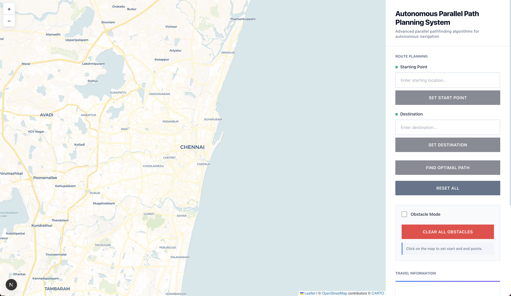

# Autonomous Parallel Path Planning System

[](https://drive.google.com/file/d/1Od502U7hioEg0EuqtHVO36FZ5RfKd1Je/view?usp=sharing)

> Click the image to view the demo video

A modern web app to compare parallel and sequential pathfinding algorithms on Chennai's real road network. Visualize, test, and benchmark different algorithms for autonomous navigation, with instant feedback and dynamic obstacle support.

---

## 🚀 Quick Start

```bash
# 1. Clone repository
git clone https://github.com/kxshrx/Autonomous-Parallel-Path-Planning.git
cd Autonomous-Parallel-Path-Planning

# 2. Backend setup (in one terminal)
cd backend
python3 -m venv venv
# Activate virtual environment:
# On macOS/Linux:
source venv/bin/activate
# On Windows:
venv\Scripts\activate
pip install -r requirements.txt
uvicorn main:app --reload --host 0.0.0.0 --port 8000  # Runs at http://localhost:8000

# 3. Frontend setup (in a new terminal)
cd ../frontend
npm install
npm run dev  # Runs at http://localhost:3000
```

> **Note:** The Chennai road network is pre-cached in the repo, so no initial download is required.

---

## 🏗️ Architecture

### Frontend (Next.js)

- Next.js 15, React 19, Zustand, React-Leaflet
- Custom CSS, reusable UI components

### Backend (FastAPI)

- FastAPI, Uvicorn, NetworkX, OSMnx, Geopy, Pydantic
- Pre-cached Chennai road network for instant startup

---

## 📖 Project Overview

- Visualizes and compares parallel vs sequential pathfinding (Dijkstra, A\*)
- Interactive map for route selection and obstacle placement
- Real-time travel time, distance, and performance metrics
- Designed for autonomous navigation research and education

---

## 📁 Project Structure

```
backend/
  main.py              # FastAPI backend
  requirements.txt     # Python dependencies
  cache/
    graph.graphml      # Pre-cached Chennai road network
frontend/
  src/
    app/
    components/
    lib/
    store/
  public/
  package.json
  next.config.mjs
README.md
```

---

## 📚 Documentation

- For API endpoints, architecture, and algorithm details: see [`documentation.md`](documentation.md)
- [View on GitHub](https://github.com/kxshrx/Autonomous-Parallel-Path-Planning)
